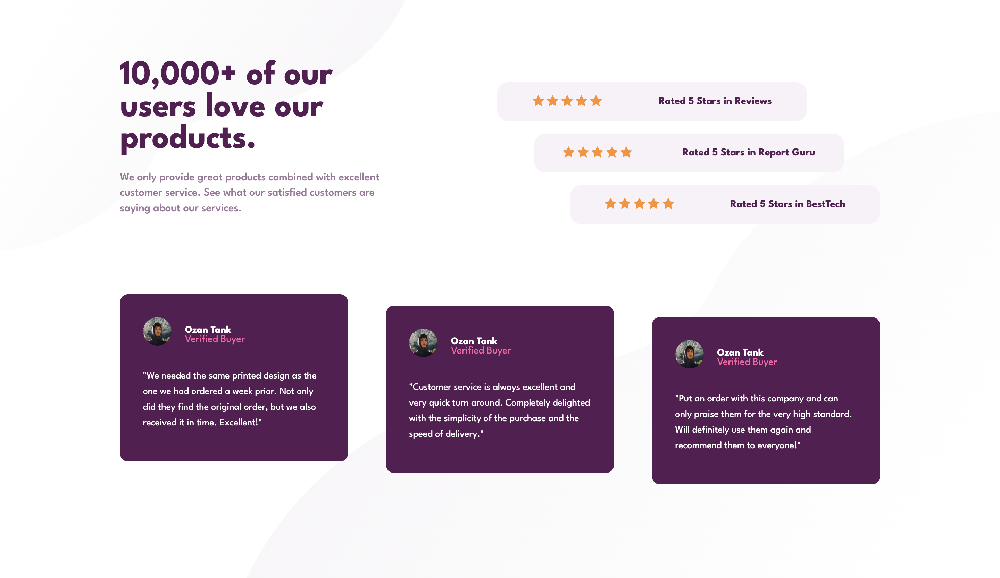
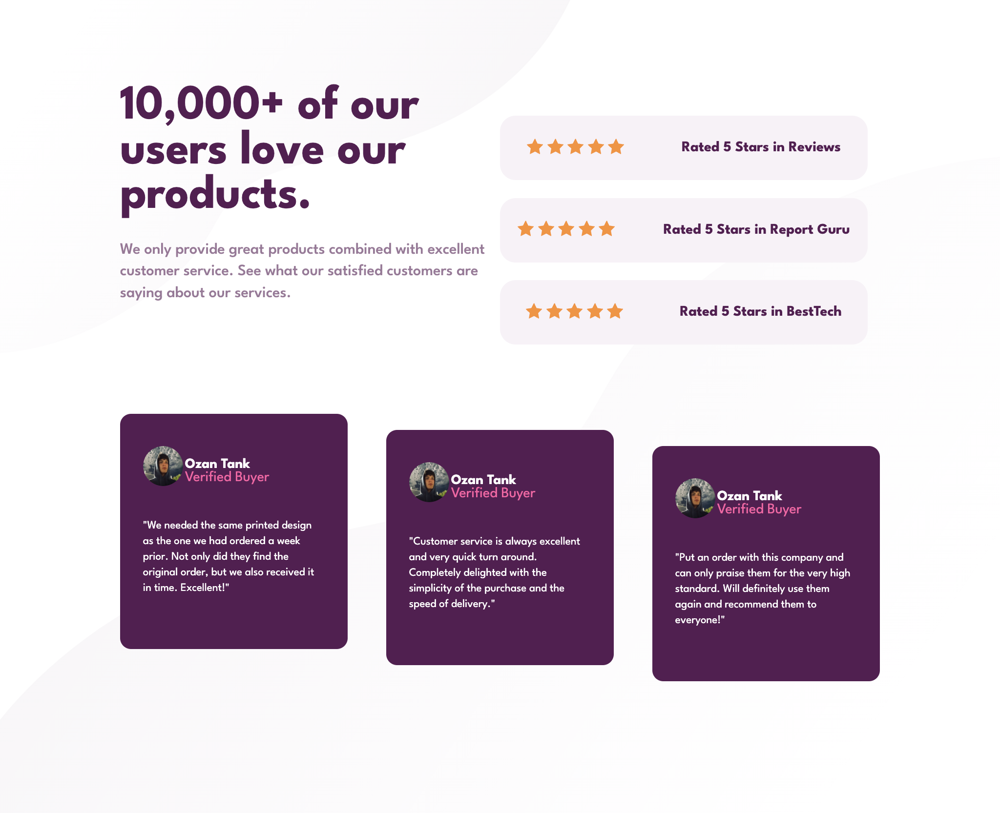
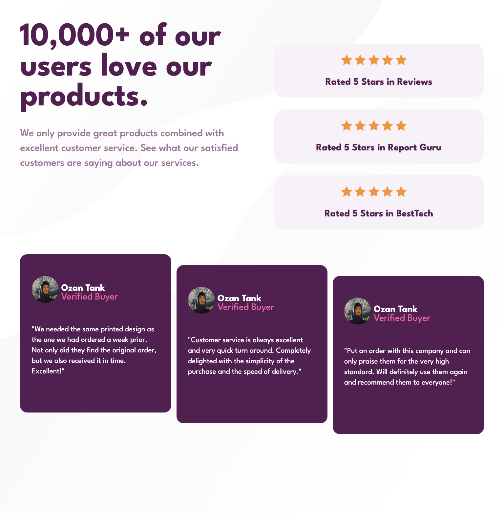
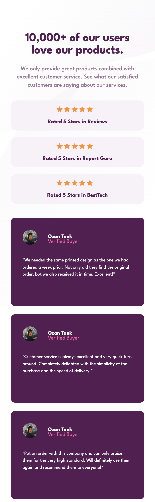

# Social proof section

## Table of contents

- [Overview](#overview)
  - [The challenge](#the-challenge)
  - [Screenshot](#screenshot)
  - [Links](#links)
- [My process](#my-process)
  - [Built with](#built-with)
  - [What I learned](#what-i-learned)

## Overview

### The challenge

Users should be able to:

- View the optimal layout for the section depending on their device's screen size

### Screenshot

### Links

- Live Site URL: [https://ozantank.github.io/social-proof/](https://ozantank.github.io/social-proof/)

## My process

### Built with

- HTML5
- CSS custom properties
- Flexbox
- CSS Grid

### What I learned

I learned more about Flexbox and CSS Grid. This projet also helped me to get better at
designing the optimal layout for different screen sizes.
